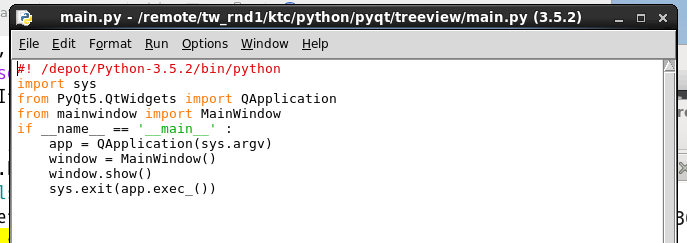
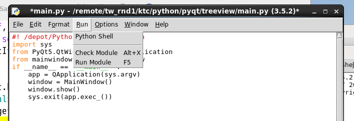
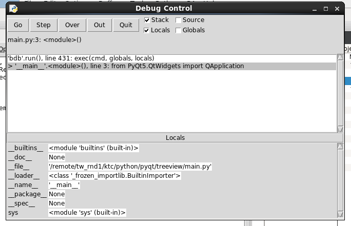

[HOME](README.md)
# Table of Contents
* [pdb basic usage](#pdb-basic-usage)
* [Debug with pdb module](#Debug-with-pdb-module)
* [Debug with idle](#Debug-with-idle)

# pdb basic usage
* b : set break point, filename:lineno | function | classname.methodname
* diable : disable break point, bpnumber
* cl : clear break point, bpnumber 
* d : down stack
* u : up stack
* s : step in
* n : next
* c : continue
* unt : until to next line
* r : return
* p : print expression


# Debug with pdb module
* using the following option to turn on pdb
```
python -m pdb main.py
```
* When debug qt problem, there will be a thread problem so we need to add the debug code into py script.
```
from pdb import set_trace
def debug_trace():
    pyqtRemoveInputHook()
    set_trace()
if __name__ == '__main__' :
    debug_trace()
    app = QApplication(sys.argv)
    window = MainWindow()
    window.show()
    sys.exit(app.exec_())
```

# Debug with idle
* &gt; idle3 main.py


* from **Run** select "Python Shell" and get the debug screen




* right click mouse on the py file to set break point
* using **F5** run the case
* from **Debug Control** to control debugger


